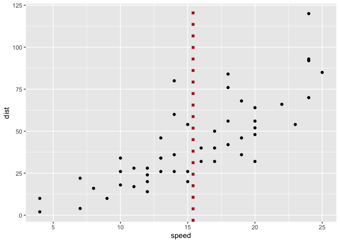

<!-- README.md is generated from README.Rmd. Please edit that file -->

# ggxmean

<!-- badges: start -->

<!-- badges: end -->

The goal of ggxmean is plot the mean of x - and some other things like
y\!

## Installation

The development version from [GitHub](https://github.com/) with:

``` r
# install.packages("devtools")
devtools::install_github("EvaMaeRey/ggxmean")
```

## Example

This is a basic example which shows you how to solve a common problem:

``` r
knitr::opts_chunk$set(eval = F)
library(tidyverse)
#> ── Attaching packages ─────────────────────────────────────── tidyverse 1.3.0 ──
#> ✓ ggplot2 3.3.2     ✓ purrr   0.3.4
#> ✓ tibble  3.0.4     ✓ dplyr   1.0.2
#> ✓ tidyr   1.0.2     ✓ stringr 1.4.0
#> ✓ readr   1.3.1     ✓ forcats 0.5.0
#> Warning: package 'ggplot2' was built under R version 3.6.2
#> Warning: package 'tibble' was built under R version 3.6.2
#> Warning: package 'purrr' was built under R version 3.6.2
#> Warning: package 'dplyr' was built under R version 3.6.2
#> ── Conflicts ────────────────────────────────────────── tidyverse_conflicts() ──
#> x dplyr::filter() masks stats::filter()
#> x dplyr::lag()    masks stats::lag()
library(ggxmean)

## basic example code
cars %>% 
  ggplot() +
  aes(x = speed,
      y = dist) +
  geom_point() + 
  # geom_xvline(alpha = .1,
  #              linetype = "dashed") +
  ggxmean:::geom_xmean(color = "firebrick",
             size = 2,
             linetype = "dotted")
```



-----

# 

``` r
cars %>% 
  ggplot() +
  aes(x = speed) +
  geom_blank() +
  geom_xmean(color = "firebrick",
             size = 2,
             linetype = "dotted")

cars %>% 
  ggplot() +
  aes(x = speed) +
  geom_blank() +
  geom_xmean(color = "firebrick",
             size = 2,
             linetype = "dotted")
```

-----

``` r
palmerpenguins::penguins %>% 
  drop_na() %>% 
  ggplot() +
  aes(x = bill_length_mm) +
  geom_rug(alpha = .3) +
  geom_histogram(alpha = .4) +
  ggxmean:::geom_xmean() +
  aes(fill = species) + # unexpected behavior here
  aes(color = species) +
  facet_wrap(facets = vars(species))
```

# another case with faceting

``` r
mtcars %>% 
  ggplot() + 
  aes(x = wt) + 
  aes(y = mpg) +
  geom_xmean() + # won't appear w/o point, probably as scale is not established
  geom_point() +
  facet_grid(rows = vars(cyl)) #+
  # geom_ymean()
```

# But:

``` r
library(ggxmean)
palmerpenguins::penguins %>% 
  drop_na() %>% 
  ggplot() +
  aes(x = bill_length_mm) +
  aes(y = flipper_length_mm) +
  geom_point() +
  ggxmean:::geom_xmean() +
  ggxmean:::geom_ymean() +
  ggxmean:::geom_yhline(alpha = .02) +
  ggxmean:::geom_xvline(alpha = .02) +
  ggxmean:::geom_xdiff() +
  ggxmean:::geom_ydiff() +
  geom_x1sd() +
  geom_y1sd() +
  geom_rsq1() +
  ggxmean:::geom_diffsmultiplied()
```
